<a href="https://selzix.com">
  <picture>
    <source media="(prefers-color-scheme: dark)" srcset="assets/header-dark.svg">
    <source media="(prefers-color-scheme: light)" srcset="assets/header-light.svg">
    
  </picture>
</a>

  
  
  
  

I'm a founder-engineer from India. I design the schema, write the API, ship the three frontends, run the servers, and increasingly write the tools that let AI agents operate the whole thing safely.

## Now building — [Selzix](https://selzix.com)

**Sell it. Rent it. Get paid for it. One workspace.**
Selzix gives Indian sellers and hosts their own store on their own link. They can sell products, rooms and stays, the payments go straight to them, and Selzix takes 0% in fees. It costs a flat ₹5,000/month, and the first 14 days are free with no card.

<table>
<tr>
<td width="50%" valign="top">

**🚀 Start from what you already have** 
Turn Instagram posts into products, copy a Shopify catalogue across, add products from photos on your phone, or start from scratch. If you're too busy, AI builds the whole store for you: brand, copy, design and catalogue.

</td>
<td width="50%" valign="top">

**🛍️ Sell products** 
Variants and inventory. Pickup, delivery slots, outlets, opening hours and holiday closures. Minimum order values, international shipping and 29 currencies.

</td>
</tr>
<tr>
<td valign="top">

**🏡 Rent out stays** 
Rooms, villas and homestays with nightly rates, an availability calendar, direct bookings and iCal sync with other booking calendars. Products and stays can live in one mixed workspace.

</td>
<td valign="top">

**💸 Get paid, stay compliant** 
The seller's own Razorpay or Stripe account, direct UPI or cash on delivery, and 0% Selzix fee. GST invoices with HSN codes and CGST/SGST/IGST splits, plus a GST return report. Shipping through Shiprocket and Delhivery.

</td>
</tr>
<tr>
<td valign="top">

**🎨 Look like a real brand** 
8 brand kits, each a full design system. A visual editor with version history and preview, 33 section types including shoppable lookbooks and before/after sliders, a form builder, and custom domains with automatic SSL.

</td>
<td valign="top">

**📈 Grow and bring buyers back** 
Coupons and automatic offers, reviews, abandoned-cart recovery, customer segments, and funnel analytics from visit to paid order. A built-in blog with SEO and scheduled posts, and Core Web Vitals monitoring for every storefront.

</td>
</tr>
</table>

**🤖 Agent-native.** Admin and seller MCP servers with scoped keys let AI agents build, redesign and check stores safely. A screenshot service lets them see their own work.

**Under the hood**

| | |
|:--|:--|
| **~224k** lines of TypeScript, in one Turborepo monorepo | **1** engineer (me) |
| **~100** Postgres tables, typed end to end with Drizzle | **3** apps built with TanStack Start: storefront, seller dashboard and admin |
| **Hono** API on **Bun**, plus Redis, Meilisearch and background workers | Vitest, Playwright E2E and **visual regression** test suites |

## Also running — [@RingtoneRobot](https://t.me/RingtoneRobot)

**A Telegram bot that has reached 1.5M+ users.** Send it any song or movie name and it replies with ringtones in seconds. There are no commands to learn and no app to install. It has been running since 2021, and about 25K people still use it every month.

| **1.5M+** users reached | **~25K** monthly users | **Since 2021** | **4** rebuilds, ending up serverless |
|:--:|:--:|:--:|:--:|

**What it took to keep a 1M+ user bot alive on a solo budget:**

- **Broadcasting to 1M+ users under Telegram's ~30 msg/s cap.** A Cloudflare Queue consumer sends in paced 25 msg/s waves. It respects `429 retry_after`, retries failed sends, and moves messages that keep failing to a dead-letter queue.
- **Crash-safe resume.** Broadcast progress is checkpointed in D1, which is strongly consistent, rather than KV, so a restart continues from where it stopped instead of re-sending. Users who block the bot are pruned in chunks that stay under SQLite's limit on bound variables.
- **Moving 1.19M users to serverless.** I moved the bot from a Python + MongoDB server to Cloudflare Workers and batch-imported the whole user base into D1.
- **One deployment, many bots.** A single Worker serves several bot identities, each with its own webhook route and its own user table.
- **Search that doesn't go down.** Queries fall back across several ringtone sources, so a broken upstream never means an empty reply.

`TypeScript` `Hono` `Cloudflare Workers` `D1` `KV` `Queues` · earlier versions: `Python` `aiogram` `FastAPI` `MongoDB` `Redis`

## How I build

- **Agents are users too.** If an AI agent can't use a feature through a well-scoped tool, the feature isn't finished.
- **One type system, end to end.** The Postgres schema, API validation and UI forms all come from the same types.
- **Screenshots before claims.** Visual regression and E2E tests run before anything ships to real sellers.
- **Own the whole path.** From `docker compose up` in production to the checkout button, I'd rather understand every layer than rent it.
- **Ship, then sharpen.** Early users teach you more than a perfect roadmap does.

## Stack

  &nbsp;&nbsp;
  &nbsp;&nbsp;
  &nbsp;&nbsp;
  &nbsp;&nbsp;
  

  
  
  
  
  
  
  
  
  
  
  
  
  

## Latest from the Selzix blog

<!-- BLOG-POST-LIST:START -->
- [Customer Retention for Small D2C Brands: How to Get Repeat Buyers Without Ads](https://selzix-blog.selzix.com/blog/customer-retention-d2c-small-business)
- [How to Start an Online Store in India: The Complete 2026 Beginner's Checklist](https://selzix-blog.selzix.com/blog/start-online-store-india-checklist)
- [The Hidden Cost of "Free" Online Store Builders in India](https://selzix-blog.selzix.com/blog/hidden-cost-of-free-store-builders)
- [How to Turn Instagram Followers Into Paying Customers (Not Just Likes)](https://selzix-blog.selzix.com/blog/turn-instagram-followers-into-customers)
- [How to Write Product Descriptions That Sell (Not Just Instagram Captions)](https://selzix-blog.selzix.com/blog/product-descriptions-that-sell)
<!-- BLOG-POST-LIST:END -->

## Activity

<picture>
  <source media="(prefers-color-scheme: dark)" srcset="https://raw.githubusercontent.com/ursmahi/ursmahi/output/snake-dark.svg">
  <source media="(prefers-color-scheme: light)" srcset="https://raw.githubusercontent.com/ursmahi/ursmahi/output/snake.svg">
  
</picture>

---

  Selling on Instagram? <a href="https://selzix.com">Try Selzix free for 14 days</a>. Building something in commerce or AI agents? <a href="https://x.com/mahikmc">Say hi</a>. 
  <i>There is no END to Learning.</i>

